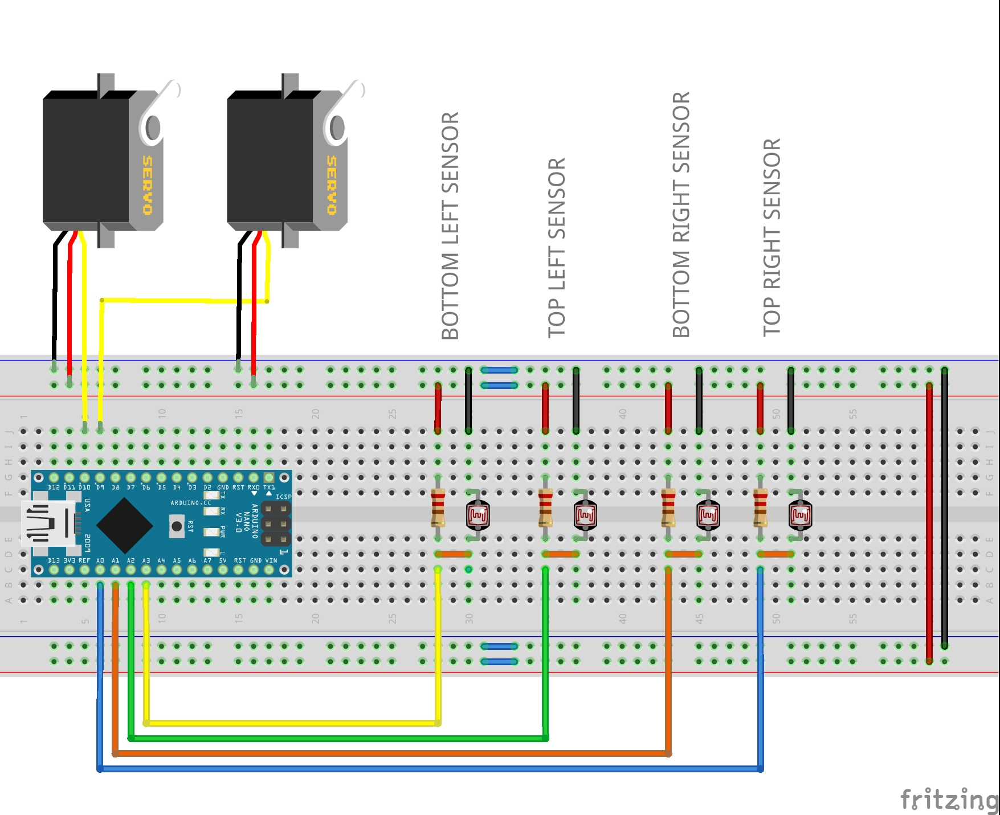

# SunflowerRobot

## Components Needed:-
  1. Arduino Nano - x1
  2. Light Dependent Resistor - 4x
  3. 10K Ohm Resisto - 4x
  4. 9g Servo motor - 2x
  5. Bread Board/perf board - 1x
  6. male to male and male to female jumpers

## Instructions:-
  > Build the circuit as shown below, and upload the sketch
  
  > Calibration of sensors:- 
      LDR sensors may not give the same output voltage at the same time due to manufacturing issues,
      So, run the program without the motors connected and with light directly shined at the flower
      
## Circuit Diagram:-

